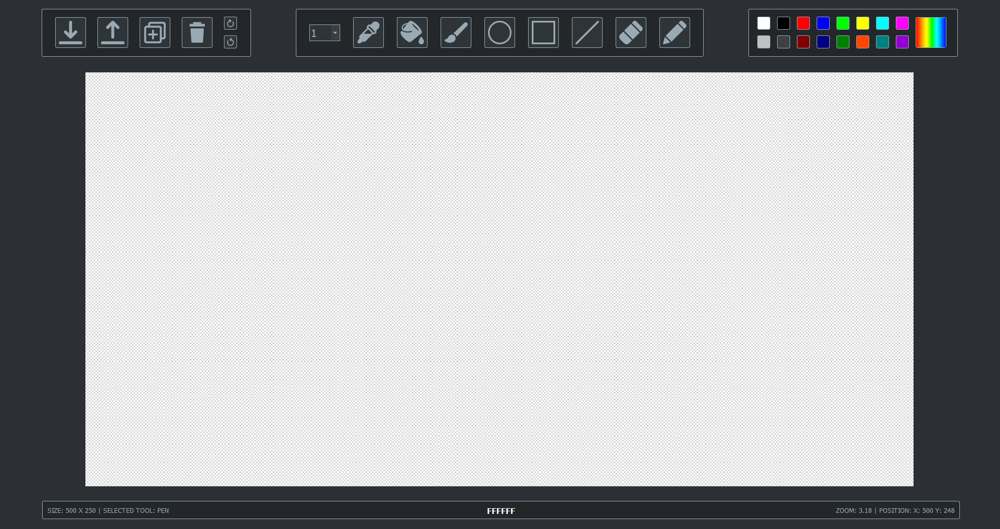

# Pixel Art Designer

## Description
Paint-like application made in Python, using PyQt5, used to draw pixel arts. Pixel art is an image drawn at pixel level and looks something like this:

## Requirements
- Python 3.7+
- PyQt5 (pip install PyQt5)
- PIL (pip install Pillow)

## User Interface

    

- top left: settings bar where are the tools to save the canvas, load an image, create a new canvas or clear the canvas (undo and redo are not implemented yet)
- top middle: tools bar where are all tools to draw on the canvas such as (from left to right) pen size, color picker, fill (is broken with a shitty recursive algorithm made in a hurry that works only on small surfaces), brush, circle, square, line, eraser and pen
- top right: color panel used to change the color
- middle: the actual canvas with its layers
- bottom: status bar where are informations about the application such as canvas dimension, selected tool, select color, zoom size and mouse's position on the canvas

## Todo or Problems
- undo and redo are not implemented yet and the way I worked with the canvas it will be hard to integrate using `QActions`
- the fill tool is just broken, works only on small surfaces
- the dimension of the UI is hard coded, if is used on a smaller screen resolution or screen dimensions then mine (full HD and 17.3") will look cut off a bit.

## References
- [Flaticon - Icons](https://www.flaticon.com)
